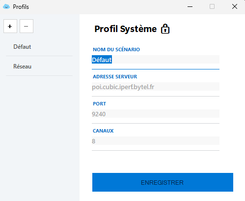

# 🚀 Speedtest Iperf

**Speedtest Iperf** est une application Windows moderne et légère conçue pour mesurer les débits réseau (Upload et Download) en embarquant l'outil **Iperf3**. 

L'outil offre une interface fluide et facile à prendre en main, tout en permettant l'exportation des résultats pour un suivi technique précis.

---

## ✨ Fonctionnalités

* **Mesure Double Flux** : Tests séquentiels du débit montant (Upload) et descendant (Download).
* **Console Temps Réel** : Suivi détaillé de l'exécution d'Iperf3 directement dans l'application.
* **Export CSV** : Sauvegarde des résultats (Date, Heure, Mbps) dans un fichier nouveau ou existant.
* **Installation Flexible** : Installateur "Dual-Mode" (installation avec ou sans droits d'administrateur).
* **Gestion des profils** : Créez différents profils persistants pour analyser l'état de votre réseau.
* **Importation et exportation** : Importez et exportez vos profils pour les tests de débits.

---

## 📸 Aperçu

> 

> 

---

## 🛠️ Installation

1. Téléchargez la dernière version du setup dans l'onglet [Releases](https://github.com/yatsuuw/IperfApp/releases).
2. Lancez `Speedtest_Iperf_v1.0.4_Setup.exe`.
3. Choisissez l'installation pour "Moi uniquement" (sans admin) ou "Pour tous les utilisateurs".

---

## 💻 Pour les Développeurs

Si vous souhaitez compiler le projet vous-même :

### Prérequis
* [.NET 10 SDK](https://dotnet.microsoft.com/fr-fr/download)
* Visual Studio 2022 ou VS Code

### Création du certificat
```
$cert = New-SelfSignedCertificate -Type CodeSigning -Subject "CN=SpeedtestIperfDev" -FriendlyName "Certificat Dev Speedtest Iperf" -CertStoreLocation "Cert:\CurrentUser\My" -NotAfter (Get-Date).AddYears(2)
```

Dans le programme "Exécuter" de Windows, écrivez "certmgr.msc", allez dans Personnel, puis dans Certificats, chercher le nom de votre certificat, puis clique droit, Toutes les tâches, et exporter.

Exportez le certificat avec une clef privée, sélectionnez AES256-SHA256, écrivez votre mot de passe, et exporter le certificat à la racine du projet sous le nom de "certificat.pfx" en sélectionnant "Parcourir...".

### Compilation
Pour générer l'exécutable (Framework-Independent) :
```bash
dotnet publish -c Release -r win-x64 --self-contained true -p:PublishSingleFile=true -p:IncludeNativeLibrariesForSelfExtract=true
```

Pour compiler et signer l'ensemble de l'application, modifiez le mot de passe dans le script à la ligne 3 pour renseigner le mot de passe que vous avez renseigné à l'exportation de votre certificat. Ensuite, faites :
```bash
./sign_github.ps1