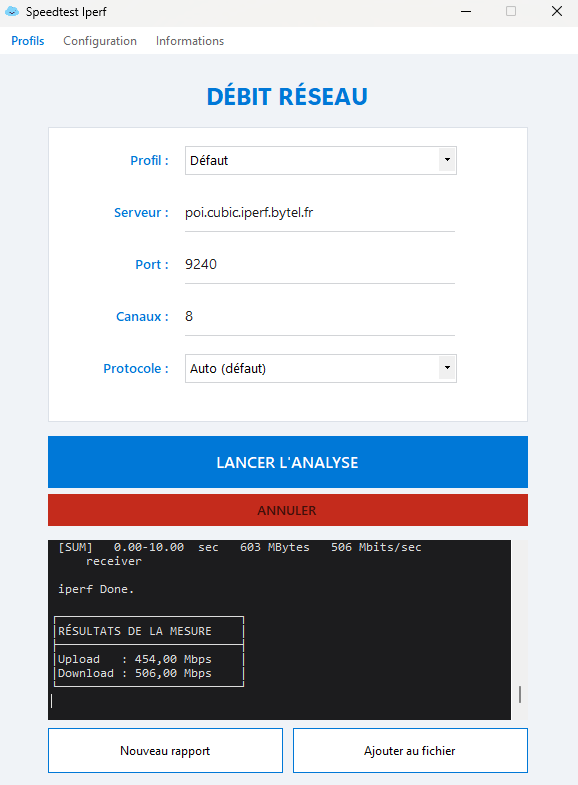
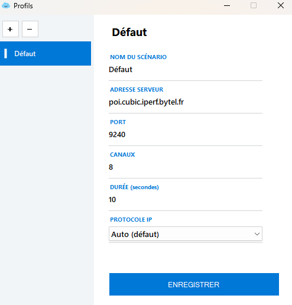

# Speedtest Iperf

**Speedtest Iperf** est une application Windows légère qui mesure les débits réseau (Upload et Download) en embarquant **iperf3**.

---

## Fonctionnalités

- **Double flux** : tests séquentiels Upload puis Download
- **Console temps réel** : sortie brute d'iperf3 affichée ligne par ligne
- **Gestion des profils** : plusieurs profils persistants (serveur, port, canaux, durée, version IP)
- **Export CSV** : résultats horodatés dans un fichier nouveau ou existant (mode append)
- **Import / Export JSON** : sauvegarde et restauration de la configuration complète
- **Rétrocompatibilité JSON** : les anciens fichiers (champs `Port`/`Channels` en chaîne, `Duration`/`IpVersion` absents) sont détectés et mis à jour automatiquement à l'import
- **Installateur dual-mode** : installation avec ou sans droits administrateur

---

## Aperçu





---

## Installation

1. Téléchargez la dernière version dans l'onglet [Releases](https://github.com/Yatsuuw/IperfApp/releases).
2. Lancez `Speedtest_Iperf_vX.X.X_Setup.exe`.
3. Choisissez "Moi uniquement" (sans admin) ou "Pour tous les utilisateurs".

---

## Arborescence

```
IperfApp/
├── Models/
│   ├── ConfigData.cs          # Configuration persistante (liste de profils)
│   ├── IpVersion.cs           # Enum IPv4 / IPv6 / Auto
│   ├── Preset.cs              # Modèle d'un profil de test
│   └── TestResult.cs          # Résultat d'un test (upload, download, horodatage)
├── Services/
│   ├── ConfigService.cs       # Chargement, sauvegarde et migration du config.json
│   ├── CsvExporter.cs         # Export CSV des résultats
│   ├── IntOrStringConverter.cs# JsonConverter tolérant string/number pour Port et Channels
│   └── JsonExporter.cs        # Sérialisation JSON générique
├── UI/
│   ├── Constants/
│   │   ├── AppColors.cs          # Palette de couleurs centralisée
│   │   └── AppFonts.cs           # Noms et tailles de fontes centralisés
│   ├── Forms/
│   │   ├── AboutForm/
│   │   │   └── AboutDialog.cs
│   │   ├── MainForm/
│   │   │   ├── MainForm.cs            # Champs, constructeur, cycle de vie
│   │   │   ├── MainForm.About.cs      # Ouverture de AboutDialog
│   │   │   ├── MainForm.Config.cs     # Gestion des profils et sauvegarde auto
│   │   │   ├── MainForm.Helpers.cs    # CreateGhostButton
│   │   │   ├── MainForm.IO.cs         # Import/Export JSON et CSV
│   │   │   ├── MainForm.Tests.cs      # RunFullTest, BuildCurrentPreset, DisplayResults
│   │   │   ├── MainForm.UI.Card.cs    # Construction des cartes UI
│   │   │   └── MainForm.UI.cs         # SetupModernUI, layout principal
│   │   └── SettingsForm/
│   │       ├── SettingsForm.cs
│   │       ├── SettingsForm.Helpers.cs
│   │       ├── SettingsForm.Logic.cs
│   │       └── SettingsForm.UI.cs
│   └── Helpers/
│       ├── DisplayHelpers.cs      # FormatMbps (débit → Kbps/Mbps/Gbps)
│       ├── FontTracker.cs         # Gestion du cycle de vie des objets Font GDI
│       ├── FormBuilderHelpers.cs  # Helpers de construction de formulaires
│       └── IpVersionExtensions.cs # ToLabel / ToComboIndex / FromComboIndex
├── Resources/
│   ├── favicon.ico
│   └── iperf3.exe
├── GlobalUsings.cs
├── Program.cs
├── IperfApp.csproj
├── installer.iss
└── sign_github.ps1
```

---

## Format du fichier de configuration

```json
{
  "SelectedPresetName": "Défaut",
  "Presets": [
    {
      "Name": "Défaut",
      "Server": "poi.cubic.iperf.bytel.fr",
      "Port": 9240,
      "Channels": 8,
      "Duration": 10,
      "IpVersion": 0,
      "IsDefault": true
    }
  ]
}
```

`IpVersion` : `0` = Auto, `1` = IPv4, `2` = IPv6.

Les anciens fichiers avec `Port`/`Channels` en chaîne de caractères ou sans les champs `Duration`/`IpVersion` sont acceptés et convertis automatiquement.

---

## Pour les développeurs

### Prérequis

- [.NET 10 SDK](https://dotnet.microsoft.com/fr-fr/download)
- Visual Studio 2022 ou VS Code

### Certificat de signature

```powershell
$cert = New-SelfSignedCertificate -Type CodeSigning -Subject "CN=SpeedtestIperfDev" `
  -FriendlyName "Certificat Dev Speedtest Iperf" `
  -CertStoreLocation "Cert:\CurrentUser\My" `
  -NotAfter (Get-Date).AddYears(2)
```

Ouvrez `certmgr.msc` → Personnel → Certificats, clic droit sur le certificat créé → Toutes les tâches → Exporter. Choisissez AES256-SHA256, définissez un mot de passe, et exportez sous le nom `certificat.pfx` à la racine du projet.

### Compilation

```bash
dotnet publish -c Release -r win-x64 --self-contained true \
  -p:PublishSingleFile=true \
  -p:IncludeNativeLibrariesForSelfExtract=true
```

Pour compiler et signer en une seule commande, renseignez votre mot de passe à la ligne 3 de `sign_github.ps1` puis exécutez :

```bash
./sign_github.ps1
```
